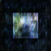
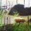
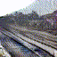
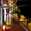

Generating Video Loops
=====================================

This repository contains the models, data, input, and output for a class project presented in CSC 2541, Fall 2016, at the University of Toronto.

Premise
-------------------

We evaluated the effectivness of the [VideoGAN](https://github.com/cvondrick/videogan) model for generating short video clips. We first explored its ability to generate simple translations, and then extend it to generate video loops by including a constraint on the first and final frame.

Contents
-------------------
This repository contains the following in their respective folders,
* Models -- The models we have trained or fine tuned for this report
* Training Data -- Scripts to produce training data and/or the data itself
* Output -- Output videos
* Paper -- The final class report

Example Rotations
-------------------
We first trained our model to generate random images and perform simple rotations. Here are several example results comparing our loops to those from the original Model.

<table><tr><td>
<strong>Ours</strong> 

 

 

</td><td>
<strong>VideoGan</strong> 

 

 

</td>
</table>

Example Output
-------------------
Below are some selected videos that are generated by our updated looping model.

<table><tr><td>
<strong>Beach and Water</strong> 

 

 

</td><td>
<strong>Trains</strong> 

 

 

</td>
</table>

Notes
-----
The code is based on [VideoGAN](https://github.com/cvondrick/videogan) which is based on [DCGAN](https://github.com/soumith/dcgan.torch) and requires [Torch7](https://github.com/torch/torch7).
